# Лабораторная работа №1. Виртуальный сервер

## Студент
- **Имя и Фамилия:** Никита Савка 
- **Группа:** I2302
- **Платформа:** MacOS на M3
- **Дата выполнения:** 11.02.2025

## Описание задачи
Цель данной лабораторной работы — ознакомление с технологиями виртуализации операционных систем и настройкой виртуального HTTP сервера. В рамках работы выполняется:

- Установка ОС Debian для серверов (архитектура x64, без графического интерфейса) с использованием гипервизора QEMU.
- Создание образа диска виртуальной машины (формат qcow2, размер 8 ГБ).
- Установка и настройка LAMP-стека:
  - **Apache2** – веб-сервер для обработки HTTP-запросов;
  - **PHP** с модулями (libapache2-mod-php, php-mysql) – для обработки серверной логики;
  - **MariaDB** – СУБД для хранения данных.
- Развёртывание дополнительных веб-приложений:
  - **PhpMyAdmin** – графическая оболочка для управления базой данных;
  - **CMS Drupal** – система управления содержимым для создания и поддержки сайта.
- Настройка виртуальных хостов Apache для обеспечения доступа к двум сайтам (phpmyadmin и drupal).
- Проведение тестирования установки и конфигурации сервисов.

## Описание выполнения работы

В данном разделе я расскажу подробно о том, как я выполнял лабораторную работу, описывая каждый шаг от скачивания необходимых файлов до тестирования развернутых сервисов. Ниже приведены этапы работы с описанием использованных команд, сайтов и скриншотов, подтверждающих выполнение каждого шага.

---

### 1. Скачивание необходимых файлов

- **Скачивание дистрибутива Debian:**
  - Я перешёл на официальный сайт Debian ([https://www.debian.org/distrib/](https://www.debian.org/distrib/)) и скачал дистрибутив для серверов (архитектура x64, без графического интерфейса).
  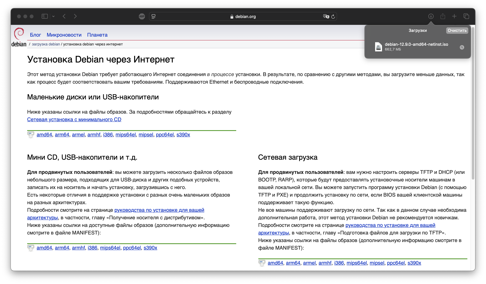

  - После завершения загрузки я переименовал скачанный файл в `debian.iso`. 


- **Скачивание гипервизора QEMU:**
  - На моей macOS (на базе M3) я установил QEMU через Homebrew, выполнив команду:
    ```bash
    brew install qemu
    ```


---


### 2. Подготовка рабочей среды

- **Создание папки и структуры файлов:**
  - Я создал в терминале рабочую папку `lab01`:
    ```bash
    mkdir lab01
    cd lab01
    ```
  - Внутри `lab01` я создал папку `dvd` для хранения ISO-образа и файл `readme.md` для отчёта:
    ```bash
    mkdir dvd
    touch readme.md
    ```
  - Затем я переместил файл `debian.iso` в папку `dvd`.

- **Создание образа диска для виртуальной машины:**
  - Находясь в папке `lab01`, я создал виртуальный диск размером 8 ГБ в формате qcow2 командой:
    ```bash
    qemu-img create -f qcow2 debian.qcow2 8G
    ```
  - **Скриншот выполнения всех команд:**


  -**Для ознакомления с дополнительными параметрами утилиты я выполнил команду:**
    ```bash
    qemu-img --help
    ```


---

### 3. Установка операционной системы Debian

- **Запуск установки:**
  - Для установки ОС Debian я выполнил следующую команду, указав путь к образу диска и ISO-файлу:
    ```bash
    qemu-system-x86_64 -hda debian.qcow2 -cdrom dvd/debian.iso -boot d -m 2G
    ```


  - Спустя время появилось меню установки, которое показано на скрншоте.
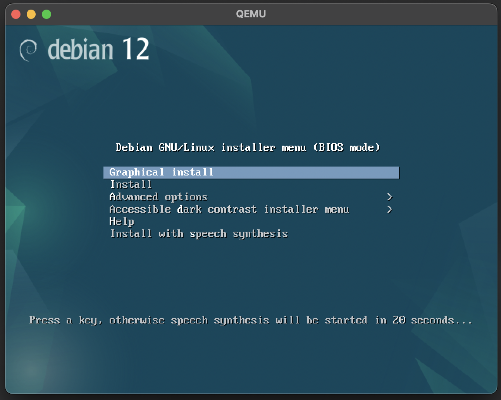

  - В процессе установки я вводил следующие параметры:
    - **Имя компьютера:** `debian`
    - **Хостовое имя:** `debian.localhost`
    - **Имя пользователя:** `user`
    - **Пароль пользователя:** `password`
  - **Скриншоты окна установки Debian Installer Boot Menu на разных этапах выбора насторйоки:** 
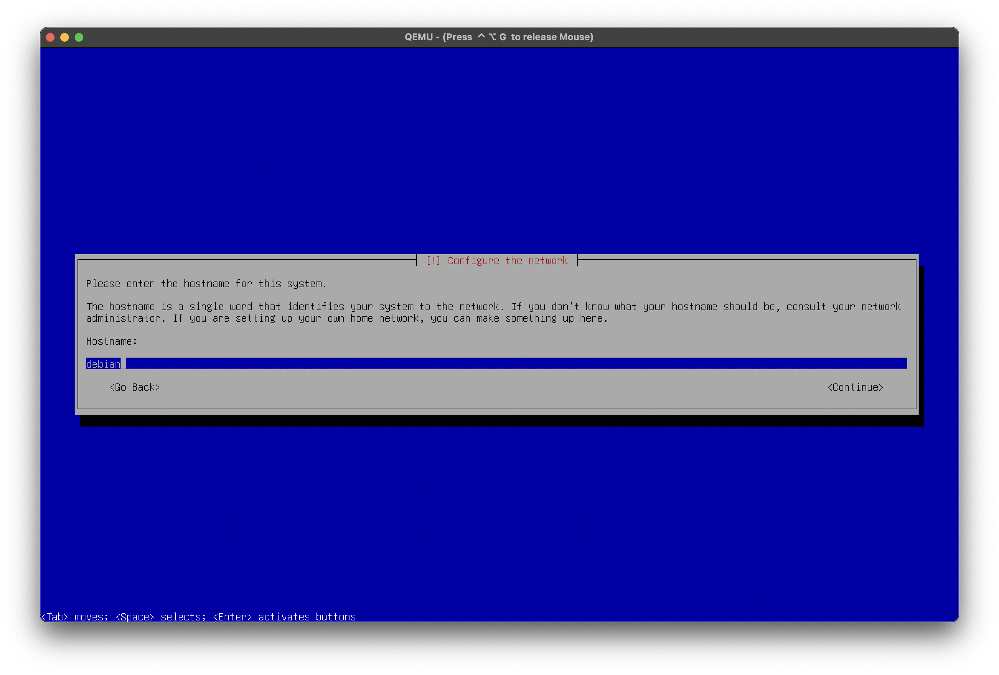
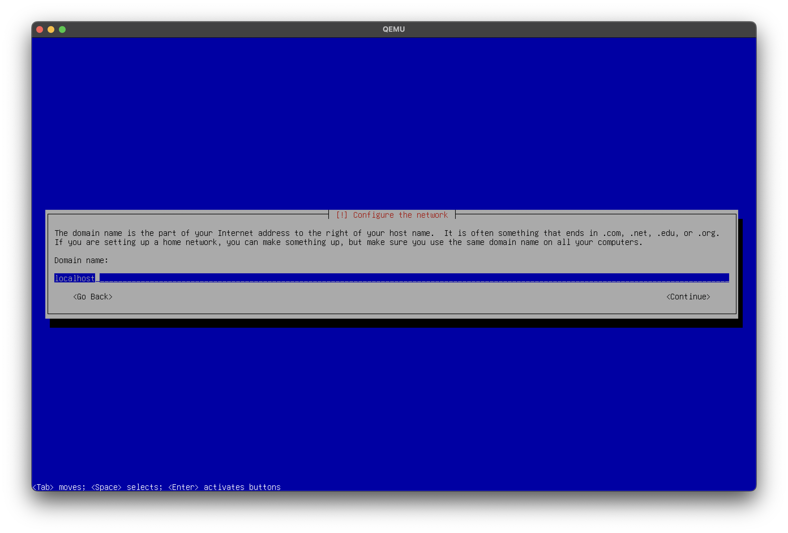
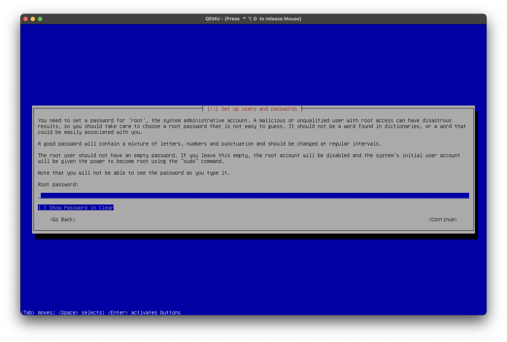
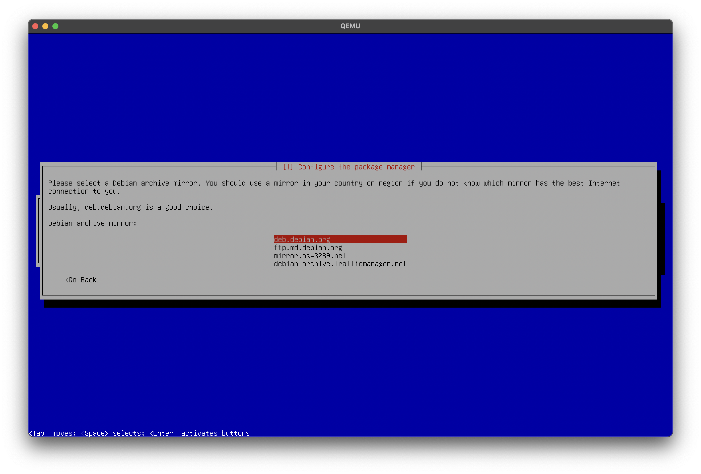
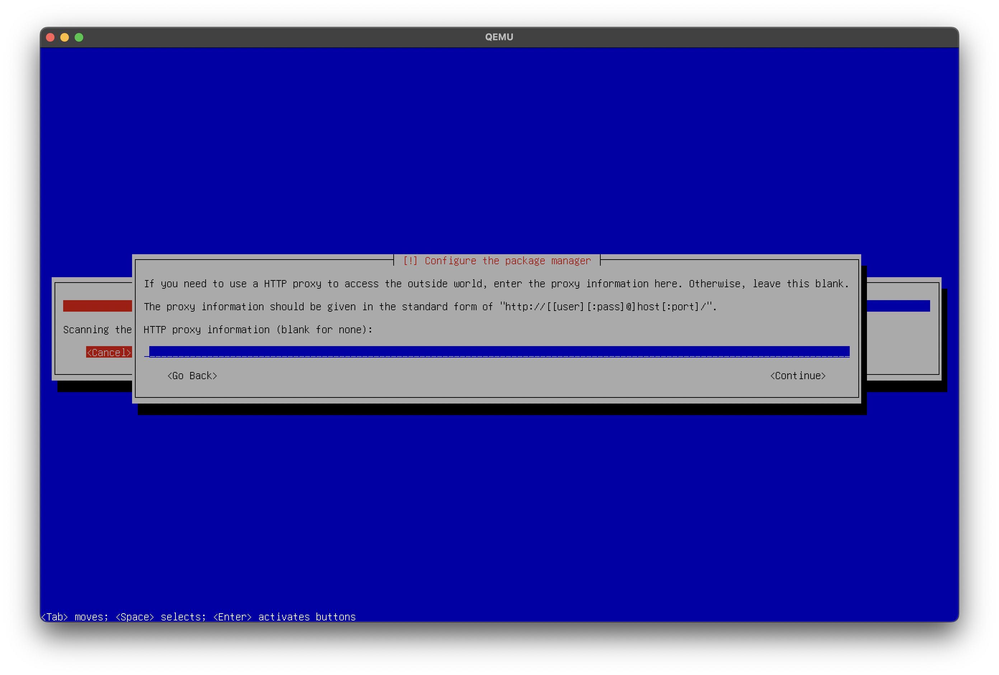
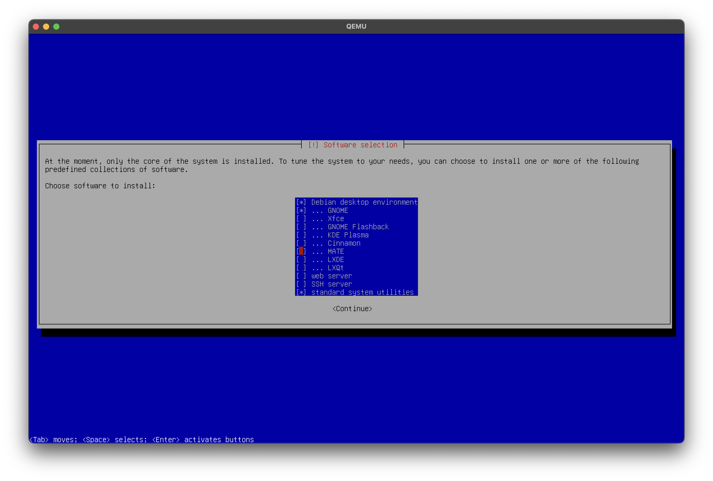

- **Перезагрузка виртуальной машины:**
  - По завершении установки я перезагрузил виртуальную машину, выполнив команду:
    ```bash
    qemu-system-x86_64 -hda debian.qcow2 -m 2G -smp 2 -device e1000,netdev=net0 -netdev user,id=net0,hostfwd=tcp::1080-:80,hostfwd=tcp::1022-:22
    ```
  - Эта команда также перенаправляет порты: порт 1080 на хосте направляется на порт 80 виртуальной машины (для HTTP), а порт 1022 – на порт 22 (для SSH).
  - **Скриншот:** *Скриншот терминала с выполнением команды перезагрузки и окно QEMU с запущенной Debian.*
  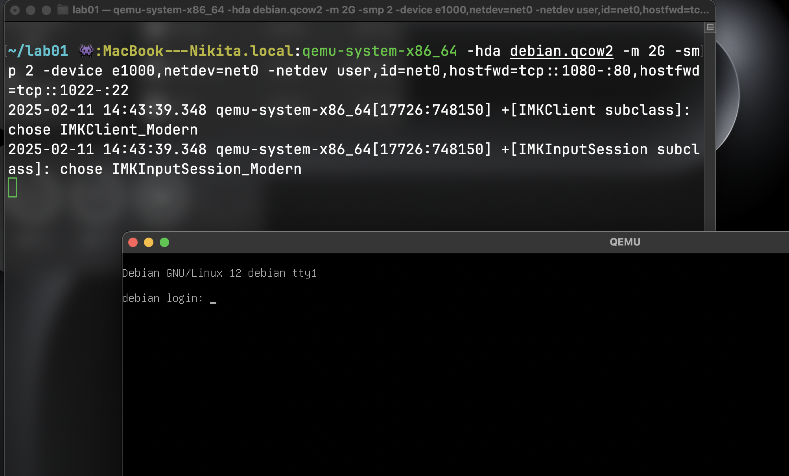

---
### 3.1 Минимальная настройка операционной системы Debian для удобства работы в ней

#### 3.1.1 Проверка, какая оболочка используется на удалённой машине и установка на zsh

Используя команду:
```
echo $SHELL
```
Далее устанавливаем Zsh на сервере используя команды: 
```
sudo apt update
sudo apt install -y zsh
```

Далее делаем Zsh оболочкой по умолчанию: После установки выполняем:
```
chsh -s $(which zsh)
```
Это изменит оболочку для пользователя на Zsh.

Теперь скопируем настройки Zsh с MacBook на сервер:
```
scp -P 1022 ~/.zshrc user@localhost:~/
scp -P 1022 -r ~/.oh-my-zsh user@localhost:~/
```

На удалённой машине установите утилиты, которые вы используете на хосте.
```
apt update
apt install -y htop (и другие утилиты)
```
#### 3.1.2 Установка SSH-сервер на виртуальную машину для работы через встроеный терминал Mac OS
- Войдем в виртуальную машину и установим SSH-сервер используя команды:

```
su
apt update
apt install -y openssh-server
```

Запустим используя правильную команду QEMU: Убедимся, что мы добавили перенаправление порта SSH (22) на хостовой машине (1022):
```
qemu-system-x86_64 -hda debian.qcow2 -m 2G -smp 2 \
-device e1000,netdev=net0 -netdev user,id=net0,hostfwd=tcp::1022-:22
```

Далее для подключения из терминала выполним команду:
```
ssh user@localhost -p 1022
```
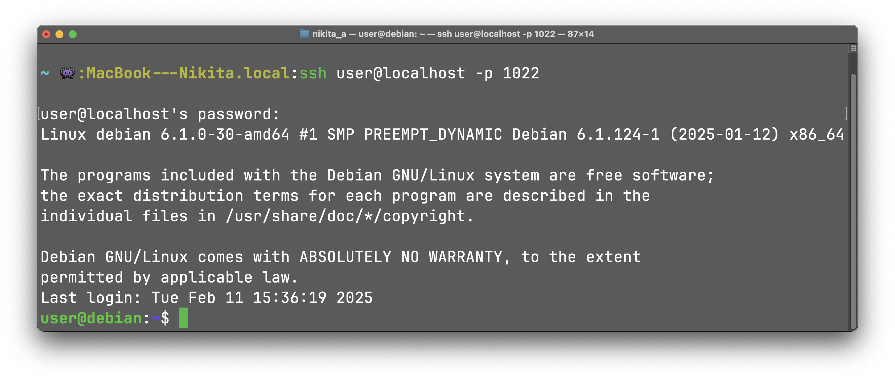

### 4. Установка LAMP-стека

- **Переключение на суперпользователя и обновление системы:**
  - Я переключился на суперпользователя:
    ```bash
    su
    ```
  - Затем обновил список пакетов:
    ```bash
    apt update -y
    ```
  - **Скриншот:** *Скриншот терминала с выводом команд `su` и `apt update`.*


- **Установка необходимых пакетов:**
  - Установил веб-сервер Apache, PHP с модулями и MariaDB, выполнив:
    ```bash
    apt install -y apache2 php libapache2-mod-php php-mysql mariadb-server mariadb-client unzip
    ```
  - Объяснение:
    - **apache2:** Веб-сервер для обработки HTTP-запросов.
    - **php и libapache2-mod-php:** Обеспечивают интерпретацию PHP-скриптов.
    - **php-mysql:** Позволяет PHP взаимодействовать с MariaDB.
    - **mariadb-server и mariadb-client:** СУБД для управления базами данных.
    - **unzip:** Утилита для распаковки архивов.
  - **Скриншот:** *Скриншот терминала с выводом установки пакетов.*
  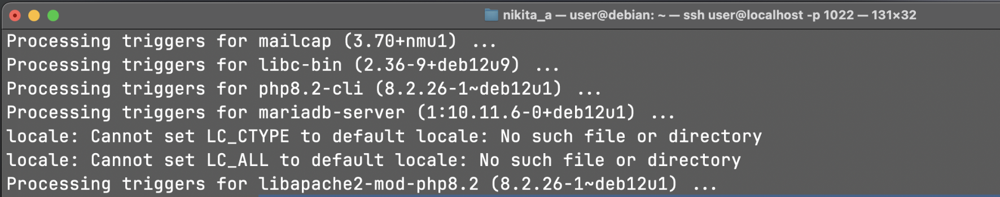

---

### 5. Скачивание и развертывание PhpMyAdmin и CMS Drupal

- **Скачивание архивов:**
  - Для PhpMyAdmin я выполнил команду:
    ```bash
    wget https://files.phpmyadmin.net/phpMyAdmin/5.2.2/phpMyAdmin-5.2.2-all-languages.zip
    ```
  - Для Drupal:
    ```bash
    wget https://ftp.drupal.org/files/projects/drupal-11.1.1.zip
    ```
  - **Скриншоты:**
    - *Скриншот терминала с выполнением команды `wget` для PhpMyAdmin.*
    

    - *Скриншот терминала с выполнением команды `wget` для Drupal.*
    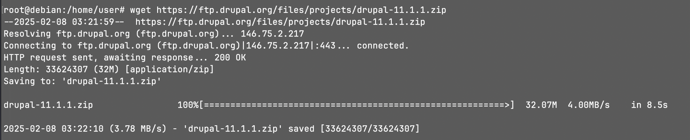

    - *Скриншот терминала с проверкой установленных архивов*
    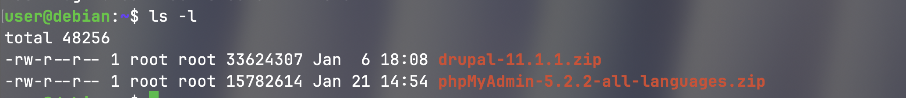
    

- **Распаковка и перемещение файлов:**
  - Я создал директорию `/var/www`, если она ещё не существовала:
    ```bash
    mkdir /var/www
    ```
  - Для PhpMyAdmin:
    ```bash
    unzip phpMyAdmin-5.2.2-all-languages.zip
    mv phpMyAdmin-5.2.2-all-languages /var/www/phpmyadmin
    ```
  - Для Drupal:
    ```bash
    unzip drupal-11.1.1.zip
    mv drupal-11.1.1 /var/www/drupal
    ```
  - **Скриншоты:**
    - *Скриншот терминала с выполнением команд `unzip` и `mv` для PhpMyAdmin.*
    

    - *Скриншот терминала с выполнением команд `unzip` и `mv` для Drupal.*
    

    - *Скриншот терминала с проверкой командой `ls -l /var/www/`.*
    

---

### 6. Настройка базы данных для CMS Drupal

- **Создание базы данных и пользователя:**
  - Я вошёл в MariaDB с помощью:
    ```bash
    mysql -u root
    ```
  - Затем в интерактивной консоли MariaDB я выполнил следующие команды:
    ```sql
    CREATE DATABASE drupal_db;
    CREATE USER 'user'@'localhost' IDENTIFIED BY 'password';
    GRANT ALL PRIVILEGES ON drupal_db.* TO 'user'@'localhost';
    FLUSH PRIVILEGES;
    EXIT;
    ```
  - **Скриншот:** *Скриншот терминала с выполнением SQL-команд в MariaDB, где видно создание базы данных и пользователя.*
  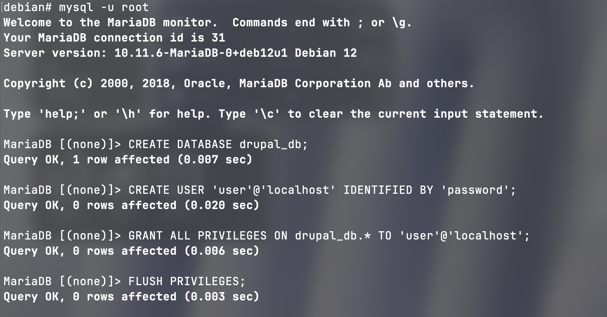
  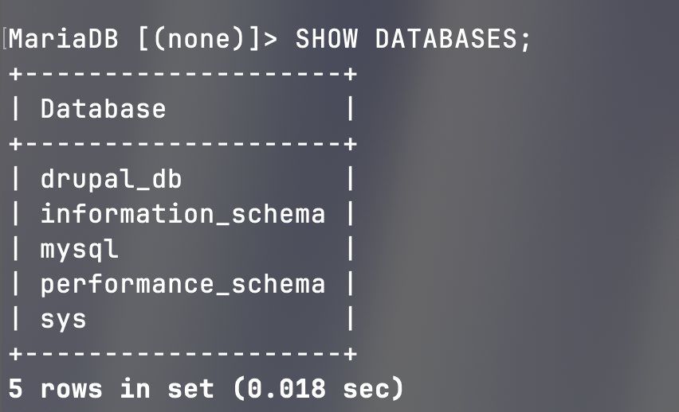

---

### 7. Настройка виртуальных хостов для Apache

- **Конфигурация виртуального хоста для PhpMyAdmin:**
  - Я открыл редактор (например, nano) для создания файла:
    ```bash
    nano /etc/apache2/sites-available/01-phpmyadmin.conf
    ```
  - В файл я добавил следующий блок:
    ```apache
    <VirtualHost *:80>
        ServerAdmin webmaster@localhost
        DocumentRoot "/var/www/phpmyadmin"
        ServerName phpmyadmin.localhost
        ServerAlias www.phpmyadmin.localhost
        ErrorLog "/var/log/apache2/phpmyadmin.localhost-error.log"
        CustomLog "/var/log/apache2/phpmyadmin.localhost-access.log" common
    </VirtualHost>
    ```
  - **Скриншот:** *Скриншот редактора (nano или vim) с открытым файлом `01-phpmyadmin.conf` и видимым содержимым.*


- **Конфигурация виртуального хоста для Drupal:**
  - Аналогично, я создал файл:
    ```bash
    nano /etc/apache2/sites-available/02-drupal.conf
    ```
  - И добавил в него:
    ```apache
    <VirtualHost *:80>
        ServerAdmin webmaster@localhost
        DocumentRoot "/var/www/drupal"
        ServerName drupal.localhost
        ServerAlias www.drupal.localhost
        ErrorLog "/var/log/apache2/drupal.localhost-error.log"
        CustomLog "/var/log/apache2/drupal.localhost-access.log" common
    </VirtualHost>
    ```
  - **Скриншот:** *Скриншот редактора с открытым файлом `02-drupal.conf`.*
 

- **Активация виртуальных хостов и настройка DNS:**
  - Я активировал оба сайта, выполнив команды:
    ```bash
    /usr/sbin/a2ensite 01-phpmyadmin
    /usr/sbin/a2ensite 02-drupal
    ```
  - Затем открыл файл `/etc/hosts` и добавил следующие строки для корректного разрешения доменных имен:
    ```
    127.0.0.1 phpmyadmin.localhost
    127.0.0.1 drupal.localhost
    ```
  - **Скриншоты:**
    - *Скриншот терминала с выполнением команды `a2ensite` и подтверждением активации сайтов.*!
    

    - *Скриншот редактора с файлом `/etc/hosts`, где видны добавленные строки.*
    

---

### 8. Запуск и тестирование развернутых сервисов

- **Проверка системной информации:**
  - Для проверки информации о ядре и системе я выполнил:
    ```bash
    uname -a
    ```
  - **Скриншот:** *Скриншот терминала с выводом команды `uname -a`.*
  

#### Разбор вывода `uname -a`:
- **`Linux`** – название ядра операционной системы.
- **`debian`** – имя хоста (компьютера).
- **`6.1.0-30-amd64`** – версия ядра Linux.
- **`#1 SMP PREEMPT_DYNAMIC Debian 6.1.124-1 (2025-01-12)`** – дополнительные данные о сборке ядра:
  - `SMP` – поддержка многопроцессорности (*Symmetric MultiProcessing*).
  - `PREEMPT_DYNAMIC` – динамическое управление приоритетами процессов.
  - `Debian 6.1.124-1 (2025-01-12)` – версия пакета ядра, установленного в системе.
- **`x86_64`** – архитектура процессора (64-битная).
- **`GNU/Linux`** – полное название ОС.

Команда `uname -a` предоставляет краткую, но важную информацию о системе, включая ядро, архитектуру процессора и дату компиляции ядра.

#### Перезагрузка Apache для применения изменений:
  - Я перезагрузил Apache командой:
    ```bash
    systemctl reload apache2
    ```
    или (в зависимости от конфигурации системы)
    ```bash
    service apache2 reload
    ```

- **Тестирование доступа к сайтам:**
  - Я открыл в браузере следующие адреса:
    - [http://drupal.localhost:1080](http://drupal.localhost:1080)
    - [http://phpmyadmin.localhost:1080](http://phpmyadmin.localhost:1080)
  - После перехода по адресам я завершил установку Drupal и PhpMyAdmin согласно инструкциям установщиков.
  - **Скриншоты:**
    - *Скриншот браузера с открытым сайтом Drupal (видна стартовая страница установки или основной интерфейс).*
    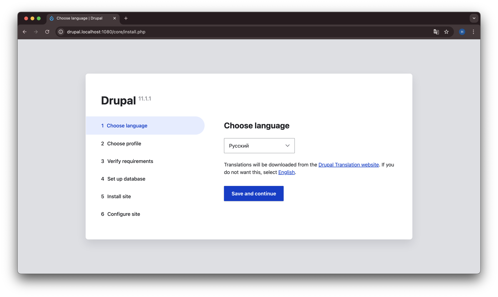
    - *Скриншот браузера с открытым сайтом PhpMyAdmin (виден интерфейс авторизации или главная страница).*
    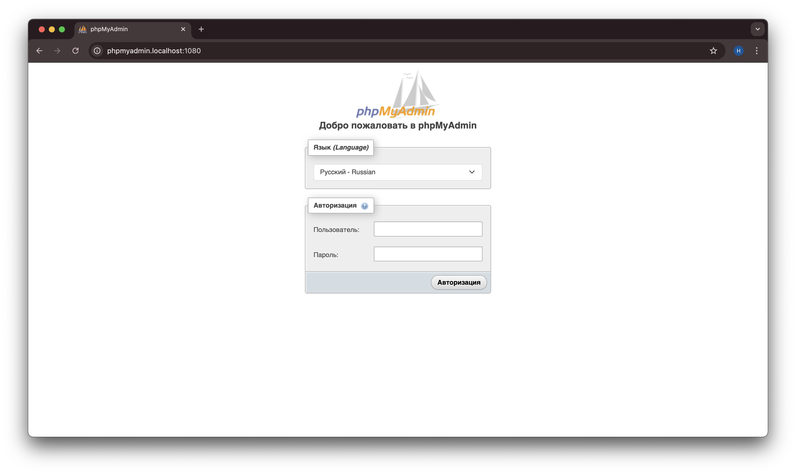
    *Скриншот браузера с открытым сайтом Drupal (полное прохождение регистрации).*
    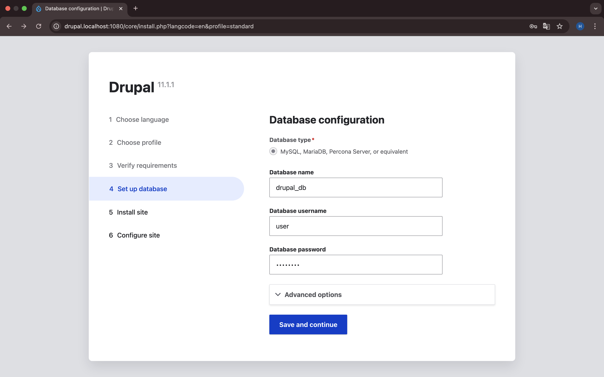
    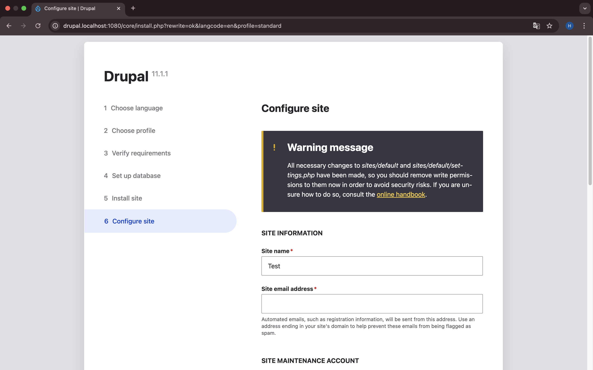
    *Скриншот браузера с открытым сайтом PhpMyAdmin (полное прохождение авторизации).*
    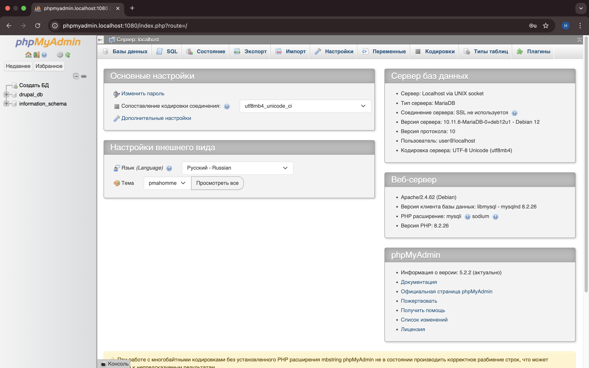

---

## Заключение

В ходе выполнения лабораторной работы мной была создана рабочая среда на базе macOS с использованием гипервизора QEMU для виртуализации. Я установил и настроил операционную систему Debian, выполнил установку и конфигурацию LAMP-стека, а также развернул и настроил веб-приложения PhpMyAdmin и CMS Drupal. Каждый этап работы был подробно задокументирован с помощью соответствующих скриншотов, что позволяет отследить процесс и убедиться в корректности выполненных действий.

Особое внимание уделялось настройке виртуальных хостов Apache, благодаря чему обеспечен корректный доступ к различным сайтам, а также улучшена безопасность и управляемость серверной инфраструктуры. Дополнительная настройка оболочки Zsh и установка SSH-сервера повысили удобство и гибкость работы с виртуальной машиной.

Таким образом, выполненная работа не только демонстрирует теоретические знания о виртуализации и администрировании серверов, но и позволяет на практике освоить основные инструменты и технологии для организации современной серверной инфраструктуры. Полученный опыт является ценным для дальнейшей работы с виртуальными машинами и веб-приложениями в реальных условиях.

# Ответ на ключевые вопросы 

### 1. Каким образом можно скачать файл в консоли при помощи утилиты `wget`?
Утилита wget предназначена для загрузки файлов из интернета через командную строку. Чтобы скачать файл, необходимо указать его URL в команде. Например, для загрузки архива PhpMyAdmin можно использовать следующую команду:
```zsh
wget https://files.phpmyadmin.net/phpMyAdmin/5.2.2/phpMyAdmin-5.2.2-all-languages.zip
```
Эта команда скачает файл по указанному URL в текущую рабочую директорию. Кроме того, wget поддерживает различные опции, позволяющие, например, возобновлять прерванные загрузки, ограничивать скорость или работать через прокси-серверы.

### 2.Зачем необходимо создавать для каждого сайта свою базу и своего пользователя?
Создание отдельной базы данных и пользователя для каждого сайта является хорошей практикой с точки зрения безопасности и администрирования. Это позволяет изолировать данные между сайтами, что существенно снижает риск: если один сайт будет скомпрометирован, злоумышленник получит доступ только к данным этого конкретного сайта, а не ко всей базе данных на сервере. Кроме того, раздельное управление пользователями упрощает настройку прав доступа и позволяет применять индивидуальные политики безопасности для каждого сайта, что снижает вероятность ошибок при управлении доступом.

### 3. Как поменять доступ к системе управления БД на порт 1234?
Для изменения порта, на котором работает СУБД (например, MariaDB), необходимо отредактировать её конфигурационный файл. Обычно это файл /etc/mysql/mariadb.conf.d/50-server.cnf или аналогичный. Находим строку, содержащую параметр port (например, port = 3306), и изменяем её на:
```
port = 1234
```
После внесения изменений сохраняем файл и перезапускаем MariaDB командой:
```
systemctl restart mariadb
```
Таким образом, СУБД начнёт принимать подключения на новом порту 1234.

### 4. Какие преимущества, с вашей точки зрения, даёт виртуализация?
Виртуализация предоставляет ряд значительных преимуществ:

- Изоляция окружений: Каждая виртуальная машина работает в собственном изолированном пространстве, что повышает безопасность и позволяет тестировать новые настройки или приложения без риска для основной системы.
- Эффективное использование ресурсов: Несколько виртуальных машин могут работать на одном физическом сервере, оптимально распределяя ресурсы и снижая затраты на оборудование.
- Масштабируемость и гибкость: Виртуальные машины легко создавать, копировать, переносить и резервировать, что упрощает администрирование и масштабирование инфраструктуры.
- Экономия энергии и затрат: За счёт консолидации серверов снижается потребление электроэнергии и затраты на охлаждение, а также уменьшается физическое пространство, необходимое для размещения оборудования.

### 5. Для чего необходимо устанавливать время / временную зону на сервере?
Корректная настройка времени и временной зоны является критически важной для стабильной работы сервера по причинам:

- Точность логов: Правильное время позволяет вести корректные записи в логах, что важно для диагностики и аудита.
- Синхронизация задач: Планировщики задач (например, cron) полагаются на корректное время для запуска запланированных заданий.
- Безопасность и аутентификация: Многие сервисы и протоколы зависят от временных меток (например, сертификаты, токены доступа), поэтому синхронизация времени помогает избежать ошибок аутентификации и проблем с безопасностью.
- Корректное отображение данных: Приложения, зависящие от временных меток, будут работать корректно, если временная зона настроена правильно.

### 6. Сколько места занимает установленная вами ОС (виртуальный диск) на хостовой машине?
В моей работе виртуальный диск был создан с размером 8 ГБ. Однако благодаря использованию формата qcow2 фактическое занимаемое место на диске может быть значительно меньше, так как qcow2 поддерживает динамическое выделение пространства. То есть, если на виртуальной машине используется меньше данных, реальное занятие места может составлять лишь несколько гигабайт, несмотря на выделенный объем в 8 ГБ.

### 7. Какие есть рекомендации по разбиению диска для серверов? Почему рекомендуется так разбивать диск?
Для серверов рекомендуется разделять диск на несколько логических разделов, что позволяет изолировать данные и повысить безопасность. Наиболее распространённое разбиение включает следующие разделы:

- `/` (корневая файловая система) – для системных файлов и программ.
- `/home` – для пользовательских данных, что позволяет сохранить их в случае переустановки ОС.
- `/var` – для логов, баз данных и динамически изменяемых данных; этот раздел часто требует большего объёма и может быть настроен отдельно для обеспечения стабильности системы.
- `/tmp` – для временных файлов, что помогает избежать переполнения корневой файловой системы.

Такое разбиение рекомендуется, поскольку:
- Оно повышает безопасность: сбой или переполнение одного раздела (например, /var) не затрагивает другие.
- Улучшает управление резервным копированием: можно настроить отдельное резервное копирование для критически важных разделов.
- Позволяет оптимизировать производительность, так как для каждого раздела можно задать отдельные параметры (например, размер, файловая система, политики монтирования).


## Библиография

1. **Debian Project**. *Debian – Universal Operating System*.  
   Доступно на: [https://www.debian.org/distrib/](https://www.debian.org/distrib/)  
   (Дата обращения: 11.02.2025)

2. **QEMU Documentation**. *QEMU – Open Source Machine Emulator and Virtualizer*.  
   Доступно на: [https://www.qemu.org/documentation/](https://www.qemu.org/documentation/)  
   (Дата обращения: 11.02.2025)

3. **Apache Software Foundation**. *Apache HTTP Server Documentation*.  
   Доступно на: [https://httpd.apache.org/docs/](https://httpd.apache.org/docs/)  
   (Дата обращения: 11.02.2025)

4. **MariaDB Corporation**. *MariaDB – Open Source Database*.  
   Доступно на: [https://mariadb.com/kb/en/](https://mariadb.com/kb/en/)  
   (Дата обращения: 11.02.2025)

5. **PhpMyAdmin**. *PhpMyAdmin Official Website*.  
   Доступно на: [https://www.phpmyadmin.net/](https://www.phpmyadmin.net/)  
   (Дата обращения: 11.02.2025)

6. **Drupal**. *Drupal – Open Source CMS*.  
   Доступно на: [https://www.drupal.org/](https://www.drupal.org/)  
   (Дата обращения: 11.02.2025)